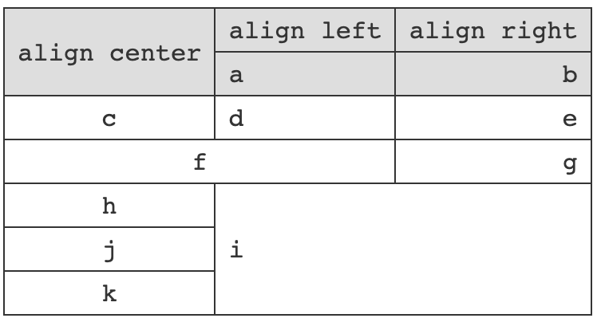

# #golden-tiger/markdown

Transform markdown text to html element.

## How to use

```js
import { transform } from '@golden-tiger/markdown'; // mjs
const { transform } = require('@golden-tiger/markdown'); // cjs

transform('# Title\n- Content');
```

- `transform` function has 2 parameters:
  - param 1 `mdText`: To transformed markdown text content.
  - param 2 `transformOptions`: Options of output.
    - `output`: `options` or `dom`. `options` means return value of `transform` function will be an object, which describes the HTML structure of the `mdText`. `dom` means return value of `transform` function will be a DOM object, which can be inserted to HTML directly.
    - `indent`: A number, which is the pixel value of indent.

- The basic syntax of `mdText` is same as normal markdown, such as <code>#</code> indicates a header, <code>></code> indicates a quota, and so on.

- Basic tables are made by separating each cell with the pipe <code>|</code> symbol, and can be enhanced further with additional options to create advanced table layouts. This online markdown editor supports <strong>rowspan and colspan</strong> markdown table.
Use <code>|(-m)...|</code> to create a m column span table cell <code>&lt;td colspan="m"&gt;</code>.
Use <code>|(=n)...|</code> to create a n row span table cell <code>&lt;td rowspan="n"&gt;</code>.
```js
// Example:
|(=2)align center|align left|align right|
|a|b|
|:-:|:--|--:|
|c|d|e|
|(-2)f|g|
|h|(-2)(=3)i|
|j|
|k|
```



